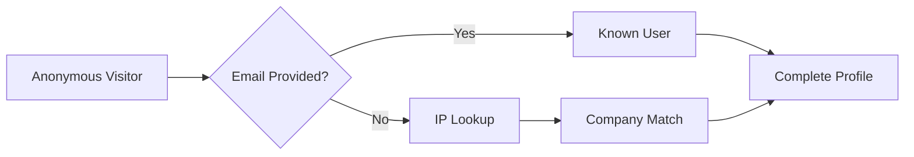

Before diving into implementation, it's important to understand the core concepts that power Koala. This guide will introduce you to the key terminology and concepts you'll encounter throughout the documentation.

## Intent Signals

Intent signals are the foundation of Koala. They represent specific actions or behaviors that indicate a prospect or customer's interest in your product.

### Types of Intent Signals

<CardGroup cols={2}>
  <Card title="Page Views" icon="eye">
    Track when prospects visit high-intent pages like pricing, features, or documentation
  </Card>
  <Card title="Form Submissions" icon="file-lines">
    Capture when visitors submit demo requests, content downloads, or contact forms
  </Card>
  <Card title="Product Usage" icon="chart-line">
    Monitor in-app behavior that indicates expansion opportunities or churn risk
  </Card>
  <Card title="Content Engagement" icon="book-open">
    See which blog posts, docs, or resources your prospects are consuming
  </Card>
</CardGroup>

## Identity Resolution

Koala's identity resolution system connects anonymous website visitors to known contacts in your CRM.

### How It Works

### Identity Sources

1. **Direct Identification**: When users log in, sign up, or submit forms
2. **Analytics Integration**: Pulling identified users from Segment, Mixpanel, etc.
3. **CRM Sync**: Matching with existing contacts in Salesforce, HubSpot
4. **IP Intelligence**: Using Clearbit Reveal for company-level identification

## Data Flow Architecture

Understanding how data flows through Koala helps you make better implementation decisions.

### Collection Methods

<Tabs>
  <Tab title="Client-side">
    JavaScript SDK installed on your website captures real-time visitor behavior
    
    **Best for:**
    - Marketing websites
    - Documentation sites
    - Public-facing pages
  </Tab>
  <Tab title="Server-side">
    Send events directly from your servers for sensitive or backend operations
    
    **Best for:**
    - SaaS applications
    - Authenticated areas
    - Custom events
  </Tab>
  <Tab title="Integrations">
    Connect existing tools to enrich Koala with additional context
    
    **Best for:**
    - Leveraging existing data
    - No-code implementation
    - Third-party tools
  </Tab>
</Tabs>

## Key Terminology

<AccordionGroup>
  <Accordion title="Visitor">
    An anonymous person browsing your website who hasn't been identified yet
  </Accordion>
  
  <Accordion title="Contact">
    A known individual with an email address in your Koala database
  </Accordion>
  
  <Accordion title="Account">
    A company or organization that contacts belong to
  </Accordion>
  
  <Accordion title="Session">
    A period of activity by a visitor, ending after 30 minutes of inactivity
  </Accordion>
  
  <Accordion title="Trait">
    A characteristic or property of a contact or account (e.g., industry, company size)
  </Accordion>
  
  <Accordion title="Event">
    A specific action taken by a visitor or contact (e.g., clicked button, viewed page)
  </Accordion>
</AccordionGroup>

## Intent Scoring

Koala automatically calculates intent scores based on visitor behavior patterns.

### Score Components

| Component | Weight | Description |
|-----------|--------|-------------|
| Recency | 40% | How recently the activity occurred |
| Frequency | 30% | How often they visit |
| Depth | 20% | Number of pages/features explored |
| Engagement | 10% | Time spent and interactions |

### Score Ranges

- **🔥 Hot (80-100)**: Immediate sales opportunity
- **♨️ Warm (60-79)**: Nurture with targeted outreach  
- **🌡️ Cool (40-59)**: Add to marketing campaigns
- **❄️ Cold (0-39)**: Continue monitoring

## Next Steps

Now that you understand the core concepts:

<CardGroup cols={2}>
  <Card 
    title="Plan Your Implementation" 
    icon="map"
    href="/implementation-guide/planning"
  >
    Determine the best approach for your organization
  </Card>
  <Card 
    title="Quick Start Guide" 
    icon="rocket"
    href="/getting-started/quick-start"
  >
    Get Koala up and running in 15 minutes
  </Card>
</CardGroup>

## Related Articles

- [How Koala Works](/getting-started/how-koala-works) - Technical deep dive
- [Understanding Identity](/implementation-guide/identity/understanding-identity) - Advanced identity concepts
- [Intent Signals Guide](/using-koala/sales-teams/understanding-intent-signals) - Practical usage tips