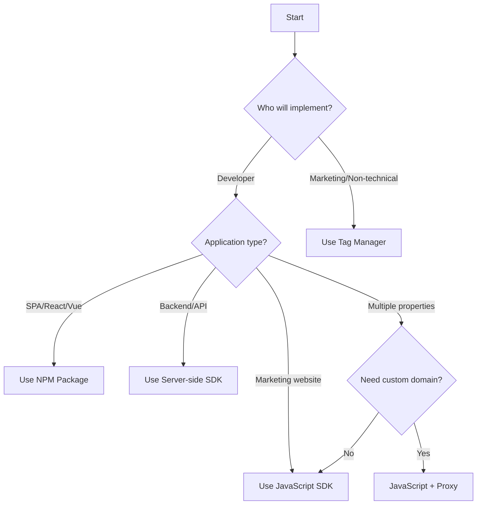

Koala offers multiple installation methods to fit different technical requirements and use cases. This guide will help you choose the right approach.

## Quick Decision Guide

<Info>
**Not sure which method to use?** Start with the JavaScript SDK - it's the fastest way to get started and works for 90% of use cases.
</Info>

## Installation Methods Comparison

| Method | Best For | Setup Time | Technical Level |
|--------|----------|------------|-----------------|
| [JavaScript SDK](/implementation-guide/installation/javascript-sdk) | Marketing sites, blogs, docs | 15 minutes | Beginner |
| [NPM Package](/implementation-guide/installation/npm-package) | React, Vue, Angular apps | 30 minutes | Intermediate |
| [Server-side SDK](/implementation-guide/installation/server-side) | Backend tracking, sensitive data | 2-4 hours | Advanced |
| [Tag Manager](/implementation-guide/installation/tag-manager) | Non-technical teams, GTM users | 30 minutes | Beginner |

## Decision Tree

## Method Details

### JavaScript SDK
<Card title="JavaScript SDK" icon="code" href="/implementation-guide/installation/javascript-sdk">
  **Pros:**
  - Fastest setup (copy & paste)
  - No build process required
  - Auto-captures page views
  - Works on any website
  
  **Cons:**
  - Client-side only
  - Can be blocked by ad blockers
  - Limited in native apps
</Card>

### NPM Package
<Card title="NPM Package" icon="npm" href="/implementation-guide/installation/npm-package">
  **Pros:**
  - TypeScript support
  - Better for SPAs
  - Tree-shakeable
  - IDE autocomplete
  
  **Cons:**
  - Requires build process
  - More complex setup
  - Client-side limitations
</Card>

### Server-side SDK
<Card title="Server-side SDK" icon="server" href="/implementation-guide/installation/server-side">
  **Pros:**
  - Most reliable tracking
  - Works with sensitive data
  - Cannot be blocked
  - Custom event support
  
  **Cons:**
  - More complex setup
  - No automatic page tracking
  - Requires backend changes
</Card>

### Tag Manager
<Card title="Tag Manager" icon="tags" href="/implementation-guide/installation/tag-manager">
  **Pros:**
  - No code deployment
  - Marketing team control
  - Easy to modify
  - Version control
  
  **Cons:**
  - Another tool to manage
  - Can impact performance
  - Limited customization
</Card>

## Common Scenarios

<Tabs>
  <Tab title="B2B SaaS">
    **Typical Setup:**
    1. JavaScript SDK on marketing site
    2. NPM package in React app
    3. Server-side for billing events
    
    **Why:** Balances ease of implementation with comprehensive tracking
  </Tab>
  
  <Tab title="Enterprise">
    **Typical Setup:**
    1. Server-side SDK only
    2. Custom proxy setup
    3. Data warehouse sync
    
    **Why:** Maximum control and security
  </Tab>
  
  <Tab title="Content Site">
    **Typical Setup:**
    1. Tag Manager implementation
    2. Enhanced with custom events
    
    **Why:** Marketing team autonomy
  </Tab>
</Tabs>

## Pre-Installation Checklist

Before you begin installation:

- [ ] **Define tracking scope**: Which domains/subdomains to track?
- [ ] **Identify key events**: What actions indicate intent?
- [ ] **Review privacy policy**: Ensure compliance with tracking
- [ ] **Plan testing approach**: Staging environment available?
- [ ] **Assign implementation owner**: Who will maintain this?

## Security Considerations

<Warning>
**Important:** If you handle sensitive data (PII, financial, health), review our [GDPR compliance guide](/implementation-guide/advanced/gdpr-compliance) and consider server-side implementation.
</Warning>

### Data Collected by Default

All methods collect:
- Page URLs and titles
- Referrer information  
- Browser and device data
- IP address (for company matching)
- Timestamp of visits

### Privacy Controls

- **IP Anonymization**: Available in all methods
- **Cookie Consent**: Built-in helpers
- **Data Retention**: Configurable per account
- **User Deletion**: API endpoint available

## Performance Impact

| Method | Page Load Impact | Runtime Impact |
|--------|------------------|----------------|
| JavaScript SDK | ~15ms | Negligible |
| NPM Package | 0ms (bundled) | Negligible |
| Server-side | 0ms | N/A |
| Tag Manager | ~25ms | Varies |

## Next Steps

Ready to install? Choose your method:

<CardGroup cols={2}>
  <Card 
    title="Quick Start Guide" 
    icon="rocket"
    href="/getting-started/quick-start"
  >
    15-minute setup with JavaScript
  </Card>
  
  <Card 
    title="Planning Guide" 
    icon="map"
    href="/implementation-guide/planning"
  >
    Plan your full implementation
  </Card>
</CardGroup>

## Need Help?

- 📚 Check our [troubleshooting guide](/reference/troubleshooting)
- 💬 Chat with support via the app
- 📧 Email support@getkoala.com
- 🎥 Watch [installation videos](/resources/video-tutorials)