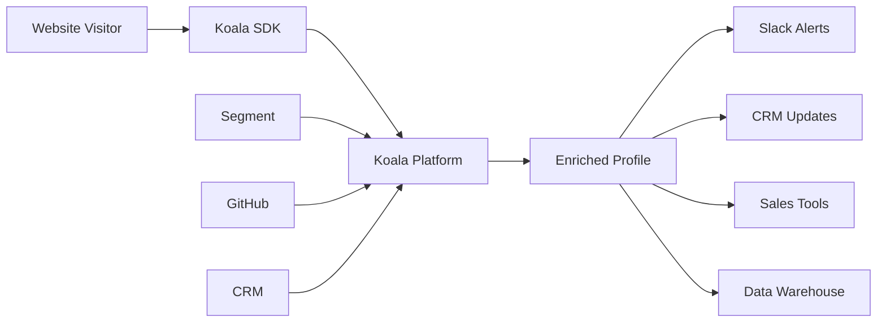

Koala integrates with your existing tech stack to provide a complete view of customer intent across all touchpoints. This guide helps you plan which integrations to implement.

## Integration Categories

<CardGroup cols={2}>
  <Card title="Web & Product Analytics" icon="chart-line">
    Import existing tracking from Segment, Mixpanel, Amplitude
  </Card>
  
  <Card title="CRM & Sales Tools" icon="users">
    Sync with Salesforce, HubSpot, and sales engagement platforms
  </Card>
  
  <Card title="Community & Social" icon="comments">
    Track engagement on GitHub, Slack, Discord, LinkedIn
  </Card>
  
  <Card title="Data Warehouses" icon="database">
    Connect Snowflake, BigQuery, Redshift for custom data
  </Card>
</CardGroup>

## Quick Start Recommendations

Based on your use case, here are recommended integrations to start with:

<Tabs>
  <Tab title="B2B SaaS">
    **Essential:**
    - Segment or Mixpanel (product analytics)
    - Salesforce or HubSpot (CRM)
    - Slack (alerts)
    
    **Nice to Have:**
    - GitHub (developer activity)
    - Intercom (support interactions)
    - Clearbit (enrichment)
  </Tab>
  
  <Tab title="Developer Tools">
    **Essential:**
    - GitHub (community engagement)
    - Segment (product data)
    - Discord/Slack (community)
    
    **Nice to Have:**
    - Stack Overflow (Q&A activity)
    - npm (package downloads)
    - ReadMe (docs engagement)
  </Tab>
  
  <Tab title="Enterprise B2B">
    **Essential:**
    - Salesforce (CRM)
    - Snowflake/BigQuery (custom data)
    - Outreach/Salesloft (engagement)
    
    **Nice to Have:**
    - LinkedIn (social selling)
    - G2 (review activity)
    - Drift/Qualified (chat)
  </Tab>
</Tabs>

## Integration Types

### 1. Data Import (One-Way)
These integrations import data into Koala to enrich visitor profiles:

| Integration | Data Imported | Setup Time |
|-------------|---------------|------------|
| Segment | Events, traits, identifies | 15 min |
| Mixpanel | User properties, events | 20 min |
| Snowflake | Custom queries | 1-2 hours |
| GitHub | Stars, issues, PRs | 10 min |

### 2. Bi-Directional Sync
These integrations both import and export data:

| Integration | Import | Export | Setup Time |
|-------------|--------|--------|------------|
| Salesforce | Contacts, accounts | Intent signals, scores | 30 min |
| HubSpot | Contacts, companies | Activities, properties | 30 min |
| Outreach | Prospects | Trigger sequences | 20 min |

### 3. Action Triggers
These integrations perform actions based on Koala signals:

| Integration | Actions | Use Case | Setup Time |
|-------------|---------|----------|------------|
| Slack | Send alerts | Real-time notifications | 5 min |
| Zapier | Custom workflows | Flexible automation | 15 min |
| Webhooks | API calls | Custom integrations | 30 min |

## Data Flow Architecture



## Integration Planning Checklist

Before connecting integrations, consider:

<Steps>
  <Step title="Define Data Requirements">
    - What visitor data do you need?
    - Which tools contain this data?
    - How fresh does the data need to be?
  </Step>
  
  <Step title="Map Data Flow">
    - Where will data originate?
    - How will it be transformed?
    - Where will it be actioned?
  </Step>
  
  <Step title="Consider Volume">
    - How many events per day?
    - API rate limits?
    - Cost implications?
  </Step>
  
  <Step title="Plan Permissions">
    - Who needs access?
    - What permissions required?
    - Security review needed?
  </Step>
</Steps>

## Common Integration Patterns

### Pattern 1: Enrichment Pipeline
```
Website Visit → Clearbit (company) → Apollo (contacts) → CRM
```

### Pattern 2: Alert & Action
```
High Intent Signal → Slack Alert → Outreach Sequence → CRM Task
```

### Pattern 3: Data Warehouse Sync
```
All Events → Snowflake → Custom Analysis → Koala Properties
```

### Pattern 4: Community Monitoring
```
GitHub Activity + Discord Chat + Forum Posts → Intent Score
```

## Security & Compliance

<Warning>
Review these considerations before connecting integrations:
</Warning>

### Data Privacy
- Only sync necessary data
- Respect user consent preferences
- Implement data retention policies
- Document data flows

### Access Control
- Use least-privilege principles
- Regular permission audits
- Secure API key storage
- Monitor integration usage

### Compliance Requirements
- GDPR: Ensure lawful basis
- CCPA: Honor deletion requests
- SOC 2: Maintain audit logs
- HIPAA: Avoid PHI transfer

## Performance Considerations

| Integration Type | Sync Frequency | Impact | Best Practice |
|-----------------|----------------|---------|---------------|
| Real-time webhooks | Instant | Low | Use for critical events |
| Batch sync | Hourly/Daily | Medium | Use for enrichment |
| Streaming | Continuous | High | Monitor carefully |
| On-demand | As needed | Variable | Cache when possible |

## Troubleshooting Guide

<AccordionGroup>
  <Accordion title="Data Not Syncing">
    1. Check API credentials
    2. Verify permissions
    3. Review error logs
    4. Test with single record
  </Accordion>
  
  <Accordion title="Duplicate Data">
    1. Check deduplication settings
    2. Review matching logic
    3. Verify unique identifiers
    4. Enable merge rules
  </Accordion>
  
  <Accordion title="Performance Issues">
    1. Reduce sync frequency
    2. Limit data scope
    3. Enable batching
    4. Check rate limits
  </Accordion>
  
  <Accordion title="Missing Fields">
    1. Verify field mapping
    2. Check data types
    3. Review permissions
    4. Test API directly
  </Accordion>
</AccordionGroup>

## Next Steps

Ready to connect your tools?

<CardGroup cols={3}>
  <Card 
    title="Web Analytics" 
    icon="chart-line"
    href="/implementation-guide/integrations/web-product-analytics"
  >
    Connect Segment, Mixpanel
  </Card>
  
  <Card 
    title="CRM Setup" 
    icon="database"
    href="/implementation-guide/integrations/crm-sales-tools"
  >
    Sync Salesforce, HubSpot
  </Card>
  
  <Card 
    title="All Integrations" 
    icon="plug"
    href="/reference/integrations/all-integrations"
  >
    Browse full catalog
  </Card>
</CardGroup>

## Best Practices

1. **Start Small**: Begin with 1-2 core integrations
2. **Test Thoroughly**: Use sandbox environments
3. **Document Everything**: Track what's connected and why
4. **Monitor Usage**: Watch API limits and costs
5. **Regular Reviews**: Audit quarterly for optimization

## Need Help?

- 📚 [Integration Catalog](/reference/integrations/all-integrations)
- 🎥 [Video Tutorials](/resources/video-tutorials)
- 💬 Chat with support
- 📧 integrations@getkoala.com