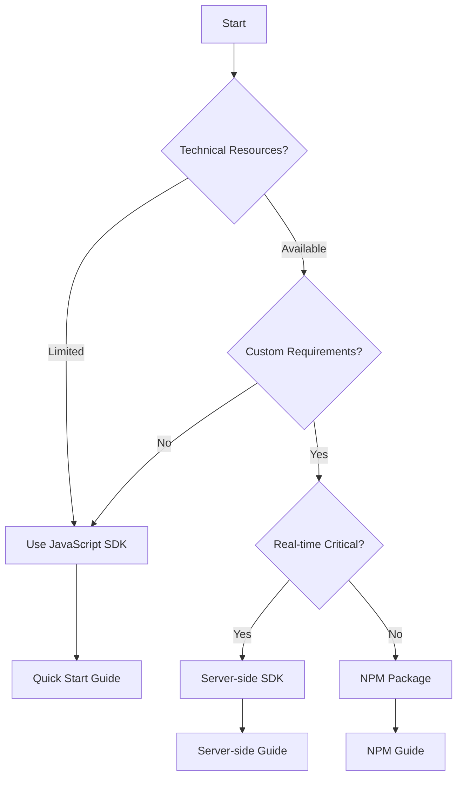

<Info>
**Time Required**: 30-45 minutes for planning, 2-5 days for full implementation  
**Team Members Needed**: Developer, Sales/Marketing Lead, Admin
</Info>

## Before You Begin

A successful Koala implementation requires coordination between technical and business teams. This guide will help you plan your rollout for maximum impact.

## Implementation Checklist

<Steps>
  <Step title="Define Your Goals">
    What do you want to achieve with Koala?
    
    - [ ] Identify high-intent prospects
    - [ ] Track customer expansion signals  
    - [ ] Monitor competitor research
    - [ ] Improve sales response time
    - [ ] Other: ________________
  </Step>
  
  <Step title="Identify Key Pages">
    Which pages indicate buying intent for your business?
    
    - [ ] Pricing page
    - [ ] Demo request form
    - [ ] Feature comparison pages
    - [ ] Documentation (for technical buyers)
    - [ ] Case studies
    - [ ] Free trial signup
  </Step>
  
  <Step title="Choose Installation Method">
    Select based on your technical requirements:
    
    | Method | Best For | Implementation Time |
    |--------|----------|-------------------|
    | JavaScript SDK | Marketing sites, quick setup | 15 minutes |
    | NPM Package | React/Vue/Angular apps | 30 minutes |
    | Server-side | Secure environments, custom events | 2-4 hours |
    | Tag Manager | Non-technical teams | 30 minutes |
  </Step>
  
  <Step title="Plan Integrations">
    Which tools will you connect?
    
    **CRM & Sales Tools:**
    - [ ] Salesforce
    - [ ] HubSpot
    - [ ] Outreach/Salesloft
    
    **Analytics:**
    - [ ] Segment
    - [ ] Google Analytics
    - [ ] Mixpanel
    
    **Communication:**
    - [ ] Slack
    - [ ] Microsoft Teams
    - [ ] Email
  </Step>
  
  <Step title="Assign Responsibilities">
    Who will own each aspect?
    
    - **Technical Implementation**: ________________
    - **Intent Signal Configuration**: ________________
    - **Sales Team Training**: ________________
    - **Ongoing Administration**: ________________
  </Step>
</Steps>

## Implementation Timeline

### Week 1: Foundation
- Day 1-2: Install Koala SDK on primary domain
- Day 3-4: Configure basic intent signals
- Day 5: Test and verify data collection

### Week 2: Expansion  
- Day 1-2: Add SDK to additional properties
- Day 3-4: Connect CRM and integrations
- Day 5: Set up Slack alerts

### Week 3: Optimization
- Day 1-2: Train sales team
- Day 3-4: Refine intent signals based on data
- Day 5: Launch advanced features

## Decision Tree: Choosing Your Path

## Common Implementation Patterns

<Tabs>
  <Tab title="SaaS Company">
    **Primary Goals**: Identify trial users showing buying signals, track feature usage
    
    **Recommended Setup**:
    1. JavaScript SDK on marketing site
    2. Server-side SDK in application  
    3. Salesforce integration
    4. Slack alerts for AEs
    
    **Key Intent Signals**:
    - Pricing page visits
    - Feature documentation views
    - Admin panel access
    - Team invitation sent
  </Tab>
  
  <Tab title="B2B Services">
    **Primary Goals**: Capture demo requests, track content engagement
    
    **Recommended Setup**:
    1. JavaScript SDK across all sites
    2. HubSpot integration
    3. Form tracking
    4. Content scoring
    
    **Key Intent Signals**:
    - Case study downloads
    - Service page dwell time
    - Contact form starts
    - Comparison page visits
  </Tab>
  
  <Tab title="Developer Tools">
    **Primary Goals**: Monitor documentation usage, API activity
    
    **Recommended Setup**:
    1. JavaScript SDK on docs
    2. Server-side for API calls
    3. GitHub integration
    4. Technical content tracking
    
    **Key Intent Signals**:
    - API documentation views
    - SDK downloads
    - Error page visits
    - Integration guide reads
  </Tab>
</Tabs>

## Security & Compliance Considerations

<Warning>
Review these items with your security team before implementation
</Warning>

### Data Privacy
- [ ] Review Koala's data processing agreement
- [ ] Determine if GDPR compliance is required
- [ ] Plan for user consent if needed
- [ ] Configure data retention policies

### Technical Security  
- [ ] Use custom proxy for sensitive environments
- [ ] Implement server-side tracking for PII
- [ ] Review firewall rules for webhooks
- [ ] Plan for staging environment testing

## Success Criteria

Define what success looks like for your implementation:

<CardGroup cols={2}>
  <Card title="Technical Success">
    - 95%+ page coverage
    - < 50ms latency impact
    - Zero implementation errors
    - All integrations connected
  </Card>
  
  <Card title="Business Success">
    - 50% faster lead response
    - 2x qualified pipeline
    - 30% higher win rates
    - ROI within 90 days
  </Card>
</CardGroup>

## Next Steps

Ready to implement? Choose your path:

<CardGroup cols={3}>
  <Card 
    title="Quick Start" 
    icon="rocket"
    href="/getting-started/quick-start"
  >
    15-minute setup guide
  </Card>
  
  <Card 
    title="JavaScript SDK" 
    icon="code"
    href="/implementation-guide/installation/javascript-sdk"
  >
    Detailed SDK guide
  </Card>
  
  <Card 
    title="Get Help" 
    icon="headset"
    href="https://getkoala.com/contact"
  >
    Talk to our team
  </Card>
</CardGroup>

## Frequently Asked Questions

<AccordionGroup>
  <Accordion title="How long does implementation take?">
    Basic implementation takes 15-30 minutes. Full rollout with integrations typically takes 2-5 days.
  </Accordion>
  
  <Accordion title="Do I need developer resources?">
    For basic JavaScript implementation, no. For server-side or custom implementations, yes.
  </Accordion>
  
  <Accordion title="Can I implement gradually?">
    Yes! Start with your highest-traffic pages and expand coverage over time.
  </Accordion>
  
  <Accordion title="What if I need help?">
    Our implementation team provides hands-on assistance for all customers.
  </Accordion>
</AccordionGroup>